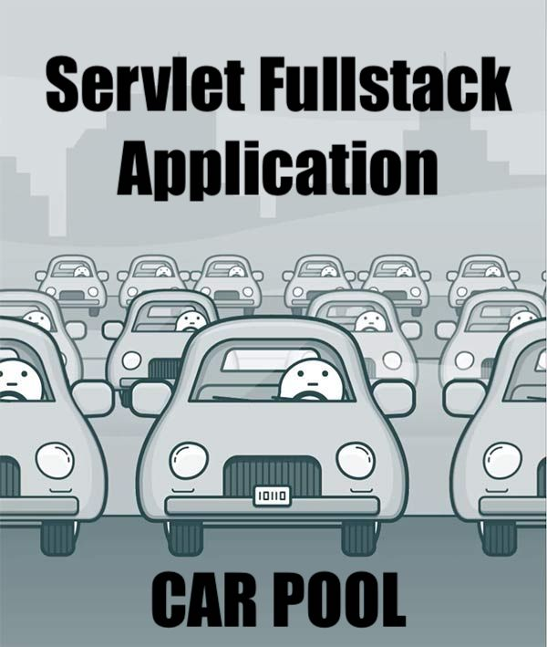

##  Description
A full-stack Java application that uses Servlets and JDBC for the back-end and JSP, HTML, and CSS for the front-end.
The application supports authentication, registration, and other CRUD operations.
Tomcat is used to handle all requests, ensuring efficient performance.

---

##  Project structure
Project based on Three-Tier architecture:
- Presentation tier (controllers) - provides user interaction with the application
- Logic tier (services) - establishes the set of available operations and coordinates the program's response to each operation.
- Data tier (DAO) - represents interaction with the database

---

## Features
- registration as a driver
- authentication
- create/update/delete a manufacturer
- create/update/delete a car
- create/update/delete a driver
- add a car to a specific driver
- display all manufacturers / cars / drivers
- display cars for authenticated driver

---

## Technologies
- Java 11
- Maven 4
- MySQL 8
- JDBC
- Apache Tomcat 9
- Servlet
- JSP
- HTML, CSS
- Cloud services

---

## Quickstart
### The application is already deployed on the Amazon server, so you can test it by simply following the <a href="http://app-env.eba-hvpvyvpu.us-east-1.elasticbeanstalk.com/login"> **link** </a>

*Use the following credentials to login:*
- email: user1@gmail.com
- password: 12345678

*Or you can register as a new user, log in and use all the functionality in the same way*

### If you want to use your database or dive into the details of the implementation, follow the instructions below:
1. Fork this repository
2. Clone the project to your computer
3. Install MySQL
4. Create new schema in database using statement from `resources/init_db.sql`. 
5. In the util / ConnectionUtil.java class set the necessary parameters for your DB connection:

``` java
    private static final String URL = "jdbc:DB_NAME://HOSTNAME:PORT/SCHEMA";
    private static final String USERNAME = "USERNAME"; 
    private static final String PASSWORD = "PASSWORD";
    private static final String JDBC_DRIVER = "jdbc driver for specified DB";
```

6. Create tables in your database also using statements in the `resources/init_db.sql` 
7. A terminal can be used to manage the database and send queries:

   `mysql -u root -p` *and enter your password*

    Then, run all the statements that need to be performed

8. Download and Install <a href="https://tomcat.apache.org/download-90.cgi">Apache Tomcat 9</a>
9. Configure Apache Tomcat: 
- ***Artifact***: `war-exploded artifact` 
- ***Application context***: `"/"`
10. Run project

**Or you can leave all the settings in the ConnectionUtil.java class and use the cloud database that is already connected and contains test data. The credentials are the same as described under the Amazon Web Services link**


---

## Author

[Vitalii Shkliarskyi](https://github.com/VitaliiShkliarskyi)

---

# Слава Україні!
