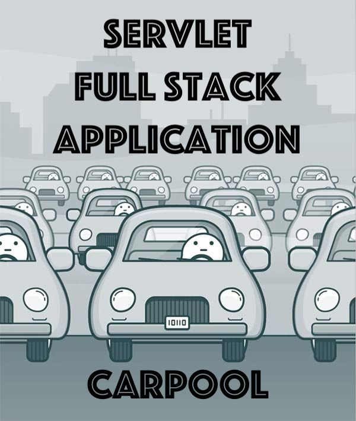

##  Description
A Full Stack Java application that uses Servlets and JDBC for the back-end and JSP, HTML, and CSS for the front-end.
The application supports authentication, registration, and other CRUD operations.
Tomcat is used to handle all requests, ensuring efficient performance.

---

##  Project structure
Project based on Three-Tier architecture:
- Presentation tier (controllers) - provides user interaction with the application
- Logic tier (services) - establishes the set of available operations and coordinates the program's response to each operation.
- Data tier (DAO) - represents interaction with the database

---

## Features
- registration as a driver
- authentication
- create/update/delete a manufacturer
- create/update/delete a car
- create/update/delete a driver
- add a car to a specific driver
- display all manufacturers / cars / drivers
- display cars for authenticated driver

---

## Technologies
- Java 11
- Maven 4
- MySQL 8
- JDBC
- Apache Tomcat 9
- Servlet
- JSP
- HTML, CSS
- Cloud services

---

## Implementation details
- **Models** represent database tables
- **ConnectionUtil** manages the database connection
- **DAOs** are responsible for all database interactions
- **Services** perform business logic and use DAOs for data access
- All interaction client-server occurs through **Controllers**
- **Injector** is used for dependency injection
- **JSP** pages are used for rendering **HTML** and **CSS** to the client
- **AuthenticationFilter** is implemented to control access to resources
- The **`web.xml`** file stores application configuration information
- The **`resources/init_db.sql`** contains statements to create the schema and tables in the database
- **Tomcat** handles all requests for efficient performance

---

## Quickstart

1. Fork this repository
2. Clone the project to your computer
3. Install MySQL
4. Create new schema in database using statement from `resources/init_db.sql`. 
5. In the util / ConnectionUtil.java class set the necessary parameters for your DB connection:

``` java
    private static final String URL = "jdbc:DB_NAME://HOSTNAME:PORT/SCHEMA";
    private static final String USERNAME = "USERNAME"; 
    private static final String PASSWORD = "PASSWORD";
    private static final String JDBC_DRIVER = "jdbc driver for specified DB";
```

6. Create tables in your database also using statements in the `resources/init_db.sql` 
7. A terminal can be used to manage the database and send queries:

   `mysql -u root -p` *and enter your password*

    Then, run all the statements that need to be performed

8. Download and Install <a href="https://tomcat.apache.org/download-90.cgi">Apache Tomcat 9</a>
9. Configure Apache Tomcat: 
- ***Artifact***: `war-exploded artifact` 
- ***Application context***: `"/"`
10. Run project

**Or you can leave all the settings unchanged and use the cloud database with the following credentials:**
- email: user1@gmail.com
- password: 12345678

---

## Author

[Vitalii Shkliarskyi](https://github.com/VitaliiShkliarskyi)

---

# Слава Україні!
